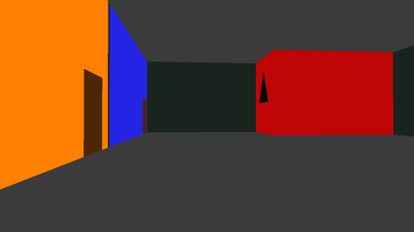

# The Escape!

## what is this?

A game I made for a class to demonstrate some stuff you can do with OpenGL, C++, and SDL2 libraries.

## how to win the game:

* escape the house

## controls:

* wasd - move
* space - jump
* mouse wheel - zoom in/out
* e and/or left click - interact/use
* ESC - win the game by giving up like a sissy

---

# build

## linux

### requirements to compile with debian (built on Linux Mint, these instructions should work with any Debian based distro)

* glut

      apt install freeglut3-dev

* glew

      apt install libglew-dev 

* opengl32 - usually comes with your graphics card drivers

* sdl2-mixer

      apt install libsdl2-mixer-dev

* glm

      apt install libglm-dev

### compile

* clone this repo

      cd TheOnlyEscapeIsESC
      mkdir build/
      cd build/
      cmake -S .

* if it fails, address requirements/dependencies and try again

